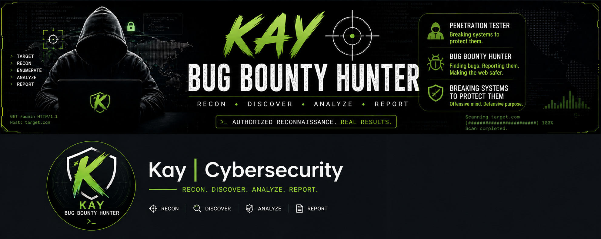

<p align="center">
  
</p>


> ⚡ Advanced Bug Bounty Reconnaissance Framework / LightRecon_security

> Built for speed, automation, efficiency and real-world security workflows


\---


\## 🚀 Overview


\*LightRecon_security is a powerful, reconnaissance tool designed for bug bounty hunters and penetration testers.


It automates the full recon pipeline — from subdomain discovery to vulnerability indicators — while maintaining a clean and professional CLI interface.


\---


\## 🎯 Features


\* 🔍 Subdomain Enumeration (Subfinder)

\* 🌐 Live Host Detection (httpx)

\* 🕸️ URL Crawling (Katana)

\* 📜 JavaScript Analysis \& Secret Detection

\* 🔎 Endpoint Extraction from JS

\* ⚔️ Parameter Discovery (Fuzzing)

\* 💉 XSS Reflection Detection (Light)

\* 🧠 Vulnerability Hint Engine(Super Investigation)

\* 🎯 Target Prioritization (High-value endpoints)

\* 📊 HTML Report Generation (Super-Clean)


\---


\## ⚙️ Installation


\### 1. Clone the Repository


```bash

git clone https://github.com/whoiskay404/LightRecon_security

cd LightRecon_security

```


\---


\### 2. Run Installer


```bash

chmod +x install.sh

./install.sh

```


\---


\## 🧪 Usage


\### Basic Scan


```bash

python3 kay_dust.py example.com 

---


\## 📂 Output Structure


\### 📁 output/


| File           | Description           |

| -------------- | --------------------- |

| subdomains.txt | Discovered subdomains |

| live.txt       | Active hosts          |

| urls.txt       | Crawled URLs          |

| js.txt         | JavaScript files      |

| endpoints.txt  | Extracted endpoints   |

| param\_fuzz.txt | Parameter discovery  |

| xss.txt        | XSS reflection hints  |

| hints.txt      | Vulnerability hints   |

| priority.txt   | High-value targets    |

| risk.txt       | Risk summary          |


\---


\### 📁 reports/


\* `target\_report.html` → Visual recon report


>>Run Command on Terminal to view html report<<

firefox target\_report.html


\---


```


\---


\## 🧠 Workflow


kay_dust follows a structured pipeline:


1\. Recon → Subdomains + Live hosts

2\. Discovery → URLs + JS files

3\. Analysis → Params + Endpoints 

4\. Detection → XSS + Hints

5\. Reporting → Risk + HTML output


\---


\## ⚠️ Disclaimer


This tool is for educational and authorized security testing only!!!!   :)


\* ✅ Use on Penetration Testing 

\* ✅ Use on bug bounty programs

\* ✅ Use on assets you own/ Homelabs

\* ❌ Do NOT scan unauthorized targets


\---


\## 👨‍💻 Author


:> Karabo Kosi<----------------------------

Cybersecurity Eng |Penetration Tester| Ethical Hacker| Bug Bounty Hunter | Red Team |

"Top 1% of the 1% Kaysociety"

Its your fav H*cker Mr Kay :) <3 u


\---


\## ⭐ Support


If you like this project:


\* ⭐ Star the repo

\* 🍴 Fork it

\* 🧠 Contribute ideas


\---


\## 🔥 Future Improvements


\* Nuclei integration

\* Advanced vulnerability detection

\* Dashboard UI (Web-based)

\* Automated reporting (PDF)

\* Strong Parameter fuzzing

\* Strong XSS injections

\* Strong API/Token testing 

\---


\## 💀 KAYSOCIETY


> “Recon is where the real hacking begins.”

> "Top 1% of the 1%"


SCREENSHOTS OF REAL-WORLD TARGET TESTING!!!!

\---Scanning


